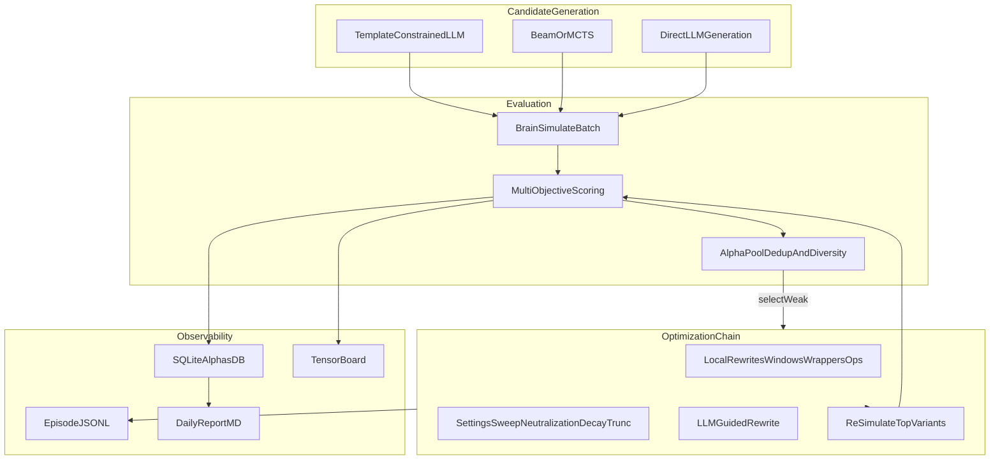
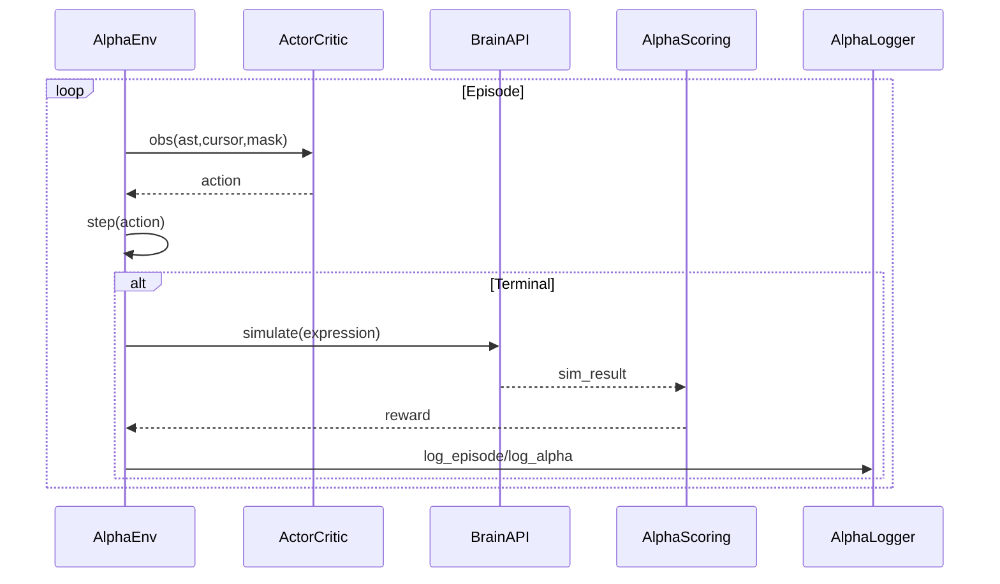

# AIAC 2.0 - Alpha Mining System (LLM + Search + Optimization + RL-ready)

本项目用于在 **WorldQuant Brain** 环境下自动挖掘可提交的 Alpha（公式表达式），包含：
- **LLM 受约束生成**（模板/结构化 JSON → 渲染成表达式）
- **搜索生成**（Beam / MCTS，带维度约束与去重）
- **优化链**（Chain-of-Alpha 风格：局部改写 + settings 扫描 + LLM guided rewrite）
- **多目标评分**（Sharpe/Fitness/可投资性/换手/相关性/多样性）
- **日志与可观测性**（JSONL episode、SQLite alpha 库、TensorBoard、日报）

---

## 项目概述

### 目标
- **每轮/每天**评估约 1000 个候选 Alpha，并尽量产出 **可提交 Alpha**（或接近门槛的候选）
- 建立“**生成 → 回测 → 评分 → 优化 → 选优 → 记录**”闭环，便于持续迭代

### 实现方式（核心思想）
- **Alpha 挖掘不是一次性“写公式”**：把挖掘当作搜索/优化问题
- 用 **模板/语法约束** 降低无效表达式比例，用 **多目标评分** 逼近 Brain 的真实约束，用 **优化链** 吃到“局部修改”的高性价比提升
- 当前实现具备 RL-ready 基建（环境、策略网络、action mask、日志），可进一步接入真正的 PPO 训练（见“待实现功能”）

---

## 架构图

### 在线挖掘流水线（Production）



### RL-ready 训练闭环（当前为“可接入”，未完全训练落地）



---

## 安装与使用

### 1) 安装依赖

建议使用 Python 3.10+：

```bash
python3 -m pip install -r requirements.txt
```

### 2) 配置 LLM API（OpenAI 兼容）

推荐用环境变量：

```bash
export BRAIN_CREDENTIAL_EMAIL="xxx"
export BRAIN_CREDENTIAL_PASSWORD="xxxx"
export OPENAI_API_KEY="sk-xxxxxx"
export OPENAI_BASE_URL="https://api.deepseek.com/v1"
export OPENAI_MODEL="deepseek-chat"
```

### 3) 运行方式

#### A. 生产挖掘（每天跑 1000 个候选）

```bash
python3 mine.py --target 1000 --region USA --universe TOP3000
```

常用参数：
- `--target`: 目标候选数（默认 1000）
- `--quick`: 快速模式（默认把 target/优化预算降到较小）
- `--no-optimize`: 关闭优化链（不推荐）
- `--opt-budget`: 优化评估预算（默认 200）
- `--method`: `beam` 或 `mcts`

输出：
- `mining_output/alphas_YYYY-MM-DD.json`：包含所有成功回测的候选与指标
- `mining_output/submittable_YYYY-MM-DD.json`：筛出的可提交候选（若存在）
- `mining_output/report_YYYY-MM-DD.md`：本次运行报告
- `logs/`：SQLite / JSONL / TensorBoard / 日报

#### B. 训练（当前实现：search-based；RL 训练可接入）

```bash
python3 train.py --iterations 100 --method beam --beam-width 50
```

如果没有 Brain API 访问或想先验证流程：

```bash
python3 train.py --mock
```

#### C. 原始模板脚本（保留）

```bash
python3 test.py
```

---

## 目录结构说明

```
worldquant-alpha-aiac/
  README.md
  requirements.txt

  # 原始/兼容 LLM 生成 + 模拟脚本（保留）
  test.py
  ace_lib.py
  helpful_functions.py

  # 评分与优化（多目标、可投资性、相关性、多样性）
  alpha_scoring.py
  optimization_chain.py
  field_screening.py
  template_bank.json
  template_renderer.py

  # RL-ready 模块（语法/环境/策略/搜索/日志）
  rl_alpha/
    __init__.py
    grammar.py
    env.py
    policy.py
    search.py
    logger.py

  # 新入口：训练/生产挖掘
  train.py
  mine.py
```

---

## 输出与日志

### Alpha 结果（示意）

`mine.py` 输出的 JSON 会包含（简化示意）：

```json
[
  {
    "alpha_expression": "rank(ts_delta(mdl110_growth, 20))",
    "economic_rationale": "...",
    "score": 0.123,
    "metrics": {
      "train_sharpe": 0.52,
      "test_sharpe": 0.31,
      "train_fitness": 0.15,
      "turnover": 0.22,
      "pool_correlation": 0.18,
      "submission_ready": false
    },
    "alpha_id": "12345678"
  }
]
```

### 日志目录
- `logs/episodes/*.jsonl`：每次搜索/episode 的行为轨迹与 reward
- `logs/alphas.db`：alpha 数据库（指标、分数、是否可提交等）
- `logs/runs/`：TensorBoard 训练指标
- `logs/daily_reports/`：日报（Top alpha / 常见失败测试分布）

---

## 关键模块说明

### 多目标评分（`alpha_scoring.py`）
核心目标：让系统优化的目标更贴近 Brain 的真实门槛/约束。
- **加入 pool correlation penalty**（避免同质化）
- **加入 diversity bonus**（鼓励探索）
- 提供 `AlphaPool`、`AlphaMetrics`、`is_submission_ready()` 等实用接口

### 优化链（`optimization_chain.py`）
- **局部改写**：符号反转、套壳（rank/zscore/scale/winsorize）、窗口扫描、算子替换、简化复杂度
- **Settings 扫描**：neutralization/decay/truncation 的 smart grid
- **LLM-guided rewrite**：用回测反馈驱动“局部重写候选”

### 搜索生成（`rl_alpha/search.py`）
- `BeamSearchEngine`：高吞吐候选生成（适合 1000/day 预算）
- `MCTSEngine`：探索更充分、可用于精修（预算更高时更合适）
- `HybridSearchEngine`：先 beam 再 mcts refine（按需开启）

---

## 待实现功能（Roadmap）

### 必做（提升命中率与可提交概率）
- **真实相关性查询接入**：目前 pool_correlation 在部分场景用结构相似度做 proxy，建议接入 Brain 的 correlation API（prod/self/pool）
- **真正的 PPO 训练闭环**：当前 `train.py` 提供 PPO 训练骨架与 search-based fallback，需要把 Brain 评价的 reward 与 rollout 更稳健地融合（含缓存/异步）
- **AST 深拷贝与增量构造优化**：当前搜索模块对 AST clone/root tracking 做了简化，建议补齐“不可变 AST / 持久化结构”以避免共享引用问题
- **回测缓存与去重**：同表达式/同 settings 的模拟结果应缓存（SQLite/磁盘缓存），减少重复 Brain 调用

### 可选（工程化与速度）
- **分布式/并行队列**：把 1000/day 拆到多进程/多机（注意 Brain API 速率限制）
- **更严格的语法/签名校验器**：对 Brain operators 的参数签名做完整约束，进一步减少无效表达式
- **字段筛选强化**：把 `field_screening.py` 的结果强制接入生成链（而不仅仅是 prompt 里建议）

---

## 优缺点与已知限制

### 优点
- **闭环完整**：生成/回测/评分/优化/日志齐全，可持续迭代
- **吞吐友好**：Beam + 批量模拟 + 去重/多样性，适配 1000/day 预算
- **可观测性强**：SQLite + JSONL + 日报，便于定位“为什么差、差在哪里”
- **RL-ready**：具备环境、策略网络、action mask 与日志基础

### 缺点 / 限制
- **相关性仍有 proxy**：未接入 Brain correlation 时只能用结构相似度近似
- **RL 训练尚未 fully productionize**：Brain API 是昂贵黑盒，PPO 的样本效率与缓存/异步策略需要进一步工程化
- **算子签名覆盖不完全**：grammar/operator 需要持续对齐 Brain 的真实算子签名与边界条件

---

## 支持的 LLM 供应商

只要支持 OpenAI 兼容协议，都可以使用（示例 Base URL）：

| 供应商 | Base URL 示例 |
|--------|---------------|
| DeepSeek | `https://api.deepseek.com/v1` |
| 硅基流动 | `https://api.siliconflow.cn/v1` |
| 通义千问 | `https://dashscope.aliyuncs.com/compatible-mode/v1` |
| 月之暗面 | `https://api.moonshot.cn/v1` |
| OpenAI | `https://api.openai.com/v1` |

---

## 支持

如有问题，请参考：
- ACE Library 文档
- WorldQuant BRAIN FAQ
- Competition Guidelines
